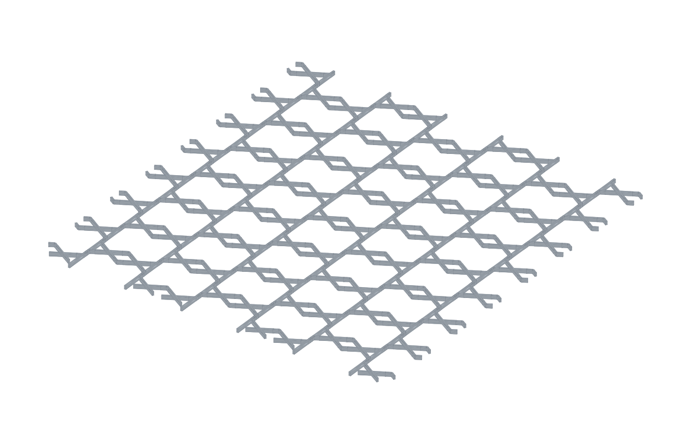

# Hex Grid Drawing Template (1-inch hexes)

This project contains a Python script that generates a printable hex-grid drawing aid for TTRPG maps.

- Common terms: **stencil** and **template** are both used for this kind of tool.
- For this use case, **template** is slightly more precise because it is meant to guide pen lines repeatedly on paper.

The generated layout follows the style in the reference image:
- short line dashes centered on each hex edge
- small 3-way “Y” junctions at each hex vertex

## Printer target

Defaults are chosen for a **Bambu Lab A1 mini** (PLA, FDM):
- Plate/envelope size target: `170 x 170 mm`
- Thickness: `1.6 mm`
- Hex size: `1 inch` flat-to-flat (`25.4 mm`)

## Files

- `hex_grid_template.py` – STL generator script
- `render_stl_preview.py` – STL-to-SVG preview renderer
- `scripts/run_local.sh` – convenience script to run the full local workflow
- `hex_grid_template_1in_a1mini.stl` – generated model

## Recommended local setup (best option): `uv`

For this repo, **`uv` + project-managed `.venv`** is the best default:

- fast, reproducible dependency installs
- isolated environment per repo
- one-command execution via `uv run`
- no Docker overhead for a small local CAD script

### 1) Install uv

See the official install methods: <https://docs.astral.sh/uv/getting-started/installation/>.

### 2) Sync dependencies

```bash
uv sync
```

This reads `pyproject.toml` and creates/updates `.venv` with `build123d`.

### 3) Generate STL

If you are using the uv-managed virtual environment, run:

```bash
uv run python hex_grid_template.py
```

If dependencies are already installed in your active Python environment,
this direct command works too:

```bash
python hex_grid_template.py
```

> Note: Recent `build123d` releases (including `0.10.x`) require the current
> location/rotation API used by this script. If you previously saw a
> `Rotation object does not support the context manager protocol` error,
> pull the latest code in this repo and rerun the command above.

### 4) Render preview SVG

```bash
uv run python render_stl_preview.py
```

### 5) (Optional) Run the full workflow script

```bash
./scripts/run_local.sh
```

## Why not Docker as default?

Docker can work, but it's not the simplest first choice here because:

- this project is a local CLI script (not a long-running service)
- iterating geometry parameters is usually faster directly in a local venv
- mounting files and handling UID/path quirks adds extra friction

If you want strict host isolation or CI-style reproducibility, Docker can be added later.

## Alternative: plain `venv` + `pip`

If you prefer standard Python tooling:

```bash
python -m venv .venv
source .venv/bin/activate
pip install -U pip
pip install build123d
python hex_grid_template.py
python render_stl_preview.py
```

## Backend

The generator uses **build123d** to create a rectangular solid plate and subtract dashed/Y cut-through slots so the final model is mostly solid with pen holes.

## Model preview



## Tuning parameters

Edit `StencilConfig` in `hex_grid_template.py`:

- `width`, `height`, `thickness`
- `hex_flat_to_flat` (default 25.4 mm)
- `slot_width`
- `edge_gap_from_vertex`
- `vertex_arm_length`
- `border`

## Suggested PLA print settings (starting point)

- Layer height: `0.20 mm`
- Wall loops: `3`
- Top/bottom layers: `4`
- Infill: `15–25%` (for plate variants)
- Brim: optional (2–4 mm) if bed adhesion is weak
- No supports

Tip: use a fine-tip pen and keep the template flat on paper for best line consistency.
